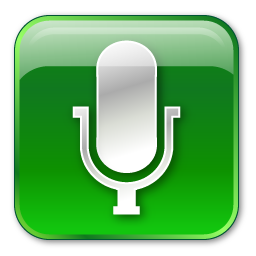

# 🗣️ Speech-to-Text Converter

Welcome to the **Speech-to-Text Converter**! This project allows you to convert your spoken words into text using the Web Speech API. 🎤✨

---

## 🚀 Features
- 🎤 **Real-Time Speech Recognition**: Convert your voice into text instantly.
- 🖍️ **Interactive Text Output**: View the transcribed text live in the app.
- 🔄 **Start/Stop Recording**: Toggle recording with a simple button click.

---

## 🛠️ Technologies Used
- **HTML** 🧒: Structure of the webpage.
- **CSS** 🎨: Styling and layout.
- **JavaScript** ✨: Speech recognition logic using the Web Speech API.

---

## 💃 File Structure
```
SpeechToTextApp/
├── index.html              # Main HTML file
├── styles.css              # CSS for styling
├── script.js               # JavaScript file for functionality
├── mic.png                 # Microphone button image
├── record-button-thumb.png # Recording button image
```

---

## 📖 How to Run
### 1. Organize Files
Make sure all files are in the same folder as shown in the **File Structure**.

### 2. Open in Browser
1. Double-click the `index.html` file to open it in your browser. 🌐

### 3. Use a Local Server (Optional but Recommended)
If you face issues with microphone access:
- Open a terminal/command prompt.
- Navigate to the project folder:
  ```bash
  cd path/to/SpeechToTextApp
  ```
- Start a local server:
  ```bash
  python -m http.server 8000
  ```
- Open your browser and go to:
  ```
  http://localhost:8000
  ```

---

## 🖱️ How to Use
1. Click the 🎤 **microphone button** to start recording.
2. Speak into your microphone. 🗣️
3. View the transcribed text in the text area. 🖍️
4. Click the button again to stop recording.

---

## 🐛 Troubleshooting
- Make sure your browser supports the **Web Speech API** (Chrome or Edge recommended).
- Allow microphone access when prompted.
- Check the **Console** (`F12` → Console Tab) for errors if something doesn’t work.

---

## 📸 Preview
  
*(Replace this with an actual screenshot if available.)*

---

## 🌟 Acknowledgments
This project uses the Web Speech API for speech recognition. Special thanks to all contributors and the open web! 💻💡

---

Feel free to modify and share! 😊

